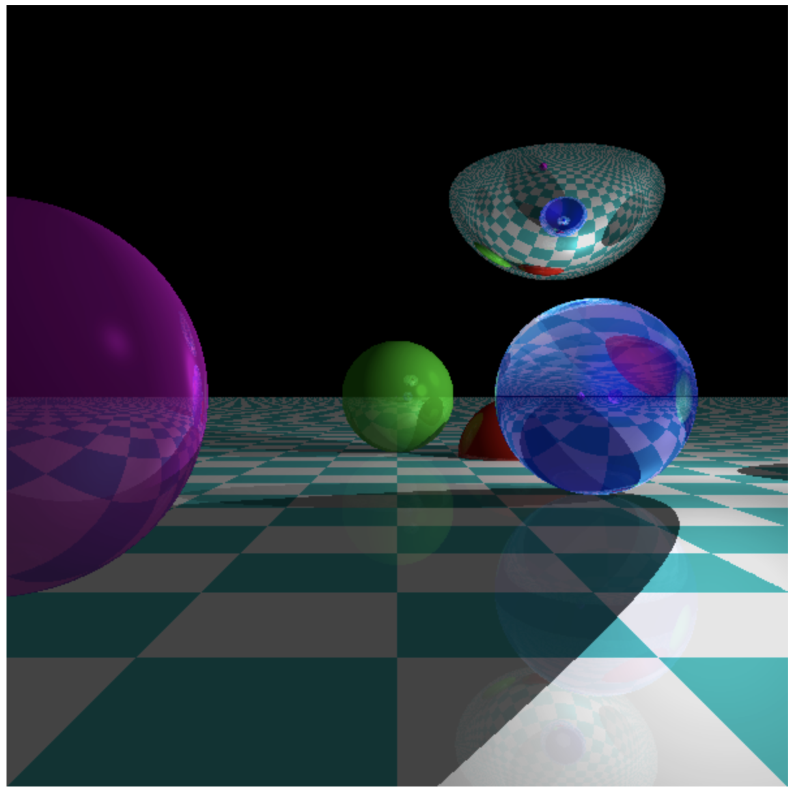

# JavaScript-Raytracing
A raytracer implemented in javascript.

Available Live Here: https://emiliano1919.github.io/JavaScript-Raytracing/

This raytracer currently implements:
- Reflection (Specular)
- Refraction/Transparency (Snells law)
- Shadows
- Planes
- Spheres

To implement:
- Triangles
- Cylinders
- Caching immutable values
- Shadow Optimizations
- Spatial Structures
- Subsampling
- Supersampling
- Constructive solid geometry

To improve:
- Code organization
    - Extract intersection code by object
    - Extract refraction
    - Add different kind of planes (vertical plane is buggy)

- References used for this project:
1. [Computer Graphics from Scratch](https://gabrielgambetta.com/computer-graphics-from-scratch/)
2. [Reflections and Refractions in Ray Tracing](https://graphics.stanford.edu/courses/cs148-10-summer/docs/2006--degreve--reflection_refraction.pdf)
3. [Scratchapixel 4.0](https://www.scratchapixel.com/index.html)

I used 1 to learn how raytracer works, and i implemented the scenes (with some modifications) of this book on this ray tracer. 2, and 3 were super useful when my refraction/transparency code was buggy (I had implemented the equations incorrectly)

This is the latest scene that i implemented. I think it is pretty cool what some linear algebra and some javascript can achieve. I will recommend anyone to do a project like this as it is very nice (It made me happy to be able to produce a visual image using just code).

